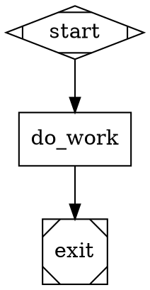

# Pipeline Reference

Syntax and attribute reference for Tractor `.dot` pipelines. This document is the source of truth for what the parser, validator, and runner understand. When this doc disagrees with the code, the code is right — file a fix.

For *design* guidance (canonical patterns, prompt advice, review checklist), see `validate-prompt.md` in this directory. For loop patterns, see `loop-patterns.md`.

## DOT Subset

Tractor uses a strict subset of Graphviz DOT.

```
digraph IDENT? {
  graph [key=value, ...]
  node  [key=value, ...]   // optional defaults
  edge  [key=value, ...]   // optional defaults

  node_id [key=value, ...]
  node_a -> node_b [key=value, ...]
}
```

Constraints:

- One `digraph` per file. `strict` and undirected `graph {...}` are rejected.
- Directed edges only (`->`). `--` is rejected.
- Node IDs match `[A-Za-z_][A-Za-z0-9_]*`. Display names go in `label`.
- Attribute values are quoted strings, integers, floats, booleans, or durations (`30s`, `10m`, `1h`).
- Both `// line` and `/* block */` comments are stripped.

`tractor validate <file>` confirms the file is a parseable, runnable pipeline. Errors block execution; warnings are advisory. See `validation-spec.md` (repo root) for the full rule catalogue.

## Pipeline Layout

A minimal valid pipeline:



Every pipeline must have **exactly one** `start` (shape `Mdiamond` or id `start`/`Start`) and **exactly one** `exit` (shape `Msquare` or id `exit`/`end`/`done`). Every node must be reachable from start, and every edge must reference real nodes on both ends.

## Graph Attributes

Set under `graph [...]`. Most are optional; `goal` is strongly recommended.

| Attribute | Type | Purpose |
|---|---|---|
| `goal` | string | One-sentence pipeline objective. Surfaces in the observer; available to prompts as `{{goal}}` (planned feature — see "Template variables" below). |
| `label` | string | Display name in the observer. |
| `rankdir` | `TB`\|`LR`\|`BT`\|`RL` | Layout direction in the observer. Default `TB`. |
| `retries` | int | Default per-node transient-retry budget when a node doesn't set its own. |
| `retry_backoff` | `exp`\|`fixed` | Default backoff strategy. |
| `retry_base_ms`, `retry_cap_ms` | int (ms) | Default backoff bounds. |
| `retry_jitter` | bool | Default jitter setting. |
| `retry_target` | node id | Pipeline-level fallback node when a node fails its retry budget. |
| `fallback_retry_target` | node id | Secondary fallback. |
| `status_agent` | `claude`\|`codex`\|`gemini`\|`off` | Provider for the optional status-summary agent (see `architecture.md`). Defaults off. |

`status_agent_prompt` is accepted but deprecated.

## Node Shapes and Types

The `shape` attribute determines the handler. Tractor recognises:

| Shape | Implied `type` | Handler module | Calls LLM | Has prompt |
|---|---|---|---|---|
| `Mdiamond` | `start` | `Tractor.Handler.Start` | no | no |
| `Msquare` | `exit` | `Tractor.Handler.Exit` | no | no |
| `box` | `codergen` | `Tractor.Handler.Codergen` | yes | yes |
| `parallelogram` | `tool` | `Tractor.Handler.Tool` | no | no |
| `hexagon` | `wait.human` | `Tractor.Handler.WaitHuman` | no | optional (`wait_prompt`) |
| `diamond` | `conditional` | `Tractor.Handler.Conditional` | no | **must NOT** |
| `component` | `parallel` | (inline in runner) | no | no |
| `tripleoctagon` | `parallel.fan_in` | `Tractor.Handler.FanIn` | optional | optional |
| (none — explicit `type=judge`) | `judge` | `Tractor.Handler.Judge` | yes | yes |

`judge` is a Tractor extension and is on a deprecation path — see `validate-prompt.md` for the spec-aligned `codergen + diamond` alternative.

If both `type` and `shape` are set they must agree; mismatches warn.

## Node Attributes

### Common (all node types)

| Attribute | Type | Purpose |
|---|---|---|
| `label` | string | Display name. Defaults to node id. |
| `class` | string | Free-form tag for analytics or custom tooling. |
| `retries` | int | Transient-retry budget. **Not** for logic FAIL — see "Retry Logic" below. |
| `retry_backoff`, `retry_base_ms`, `retry_cap_ms`, `retry_jitter` | — | Backoff config. |
| `retry_target`, `fallback_retry_target` | node id | Where to route on retry exhaustion. |
| `goal_gate` | bool | If true, the node is a goal gate — failure routes through the configured retry target chain rather than terminating the pipeline. |

### Codergen (LLM) — `shape=box`

| Attribute | Type | Purpose |
|---|---|---|
| `prompt` | string | Required. Templated against the run context before each call. |
| `llm_provider` | `claude`\|`codex`\|`gemini` | Required. |
| `llm_model` | string | Optional model id. Tractor does not maintain an allowlist — it must be one your provider can serve. |
| `timeout` | duration (`600s`, `10m`) | Per-call timeout. Default 600s. |
| `max_iterations` | int | Cap on how many times this node may be re-entered through loops. Default 3. |
| `reasoning_effort` | string | Passed through to providers that accept it. |
| `allow_partial` | bool | Whether `partial_success` outcomes count as continuing rather than failing. Requires `retries > 0`. |

Per-node artifacts are written under `<run_dir>/<node_id>/`: `prompt.md` (rendered prompt), `stderr.log`, plus per-iteration directories when `max_iterations > 1`.

### Conditional (gate) — `shape=diamond`

| Attribute | Type | Purpose |
|---|---|---|
| (no prompt allowed) | — | Diamond gates are pure routing — they evaluate outgoing edge conditions in priority order and pick the first match. |

If no condition matches at runtime the run fails. Always have either a fallback unconditional edge or a condition that's guaranteed to match.

### Tool — `shape=parallelogram`

| Attribute | Type | Purpose |
|---|---|---|
| `command` | list of strings | Required. argv-style command. |
| `cwd` | string | Working directory. Defaults to the run directory. |
| `env` | string→string map | Extra env vars. |
| `stdin` | string | Templated against context, then piped to the process. |
| `max_output_bytes` | int | Stdout cap (1 to 100_000_000). Default 1_000_000. |

Tool nodes warn (`tool_node_warning`) — the spec-aligned recommendation is to prefer a codergen node that can diagnose and retry. Use tools only when a deterministic shell call is genuinely the right shape.

### Wait-human — `shape=hexagon`

| Attribute | Type | Purpose |
|---|---|---|
| `wait_prompt` | string | Question shown to the operator. |
| `wait_timeout` | duration | If unset, the run waits indefinitely. |
| `default_edge` | edge label | Edge to follow when `wait_timeout` fires. |

Wait-human nodes warn (`human_gate_warning`) — production pipelines should run autonomously.

### Parallel — `shape=component`

| Attribute | Type | Purpose |
|---|---|---|
| `max_parallel` | int (1–16) | Cap on concurrent branches. Default 4. |
| `join_policy` | `wait_all` | Currently the only supported policy. |

Branches must currently be exactly one node each, then converge on a single `parallel.fan_in` node. Nested parallel blocks are not yet supported.

### Parallel fan-in — `shape=tripleoctagon`

A consolidator for parallel branches. Two modes:

| Configuration | Behavior |
|---|---|
| no `llm_provider` | Pure consolidation — emits a deterministic text summary of branches. |
| `llm_provider` set + `prompt` | LLM consolidation — prompt has access to `{{branch:<id>}}` and `{{branch_responses}}`. |

Updates context with `parallel.fan_in.best_id`, `parallel.fan_in.best_outcome`, `parallel.fan_in.summary`.

### Judge — `type=judge` (no shape mapping)

LLM-or-stub verdict that auto-routes by parsing a JSON `{"verdict": "...", "critique": "..."}` from the agent's response. Sets context keys `<node_id>.last_verdict` and `<node_id>.last_critique`. **Deprecation candidate** — see `validate-prompt.md` for why and what to use instead.

| Attribute | Type | Purpose |
|---|---|---|
| `prompt` | string | Required (LLM mode). |
| `llm_provider`, `llm_model`, `timeout` | — | Same as codergen. |
| `judge_mode` | `llm`\|`stub` | `stub` produces deterministic verdicts (run_id+node_id+iteration → hash) for loop demos without spending tokens. |
| `reject_probability` | float [0,1] | Stub mode only. |
| `accept_critique`, `reject_critique` | string | Stub mode only — text emitted on each verdict. |
| `allow_partial` | bool | Whether to accept `partial_success` as a third verdict. |

Outgoing edges must use shorthand `condition="accept"`, `condition="reject"`, and (if `allow_partial=true`) `condition="partial_success"`. Coverage is enforced by the `judge_edge_cardinality` validator rule.

## Edge Attributes

| Attribute | Type | Purpose |
|---|---|---|
| `label` | string | Edge label. Used by judge-style routing and for display. |
| `condition` | string | Routing predicate evaluated against the source node's outcome and the run context. See "Condition Syntax" below. |
| `weight` | float | Reserved for future tiebreaking; currently unused. |

## Condition Syntax

Conditions appear on outgoing edges of `diamond` and `judge` nodes. Tokens are whitespace-tolerant.

```
expr     := or_expr
or_expr  := and_expr ( "||" and_expr )*
and_expr := not_expr ( "&&" not_expr )*
not_expr := "!"? atom
atom     := "(" expr ")"
          | shorthand
          | key op literal
shorthand:= "accept" | "reject" | "partial_success"
key      := "outcome" | "preferred_label" | "context." dotted_path
op       := "=" | "!=" | "<" | "<=" | ">" | ">=" | "contains"
literal  := quoted_string | bare_word | number
```

Important details from `lib/tractor/condition.ex`:

- Logical: `&&`, `||`, `!`. Single `&` and `|` are not accepted.
- Comparisons coerce values to strings except for `<`/`<=`/`>`/`>=`, which try to parse both sides as floats and return `false` if either side isn't numeric.
- `contains` is substring match on the stringified value.
- The bare keywords `accept`, `reject`, `partial_success` (without an operator) match the source's `preferred_label` — they're the canonical idiom for routing off a `judge` node.
- Unknown keys evaluate to the empty string.

### Built-in keys

| Key | Resolves to |
|---|---|
| `outcome` | The source node's status (e.g. `success`, `partial_success`). For codergen nodes the underlying status is currently always `ok` — prefer matching against `context.<node>.last_output` for codergen routing. |
| `preferred_label` | Set by handlers that drive label-based routing (today: `judge`). |
| `context.<key>` | Direct lookup against the flat run context map (see "Run Context" below for what's populated). Falls back to dotted-path traversal. |

### Examples

```dot
// Judge shorthand
gate -> retry [condition="reject"]
gate -> next  [condition="accept"]

// Codergen + diamond — match VERDICT line in reviewer's response
review -> gate
gate -> retry [condition="context.review.last_output contains \"VERDICT: reject\""]
gate -> next  [condition="context.review.last_output contains \"VERDICT: accept\""]

// Numeric threshold from earlier context
score -> gate
gate -> strong [condition="context.score >= 0.8"]
gate -> weak   [condition="!(context.score >= 0.8)"]
```

## Template Variables

Prompts and `stdin` strings are rendered through `Tractor.Context.Template` (`lib/tractor/context/template.ex`) before the handler executes. Syntax: `{{...}}`.

| Form | Resolves to |
|---|---|
| `{{key}}` | Direct lookup of `key` in the run context. |
| `{{node_id}}` | The node's last output (set by the runner when the iteration completes). |
| `{{node_id.last}}` | Same as above (alias for `node_id.last_output`). |
| `{{node_id.last_critique}}` | The last critique stored for that node (judge nodes only, today). |
| `{{node_id.iteration(N)}}` | Output of iteration `N` of `node_id`. |
| `{{node_id.iterations.length}}` | Number of completed iterations of `node_id`. |
| `{{branch:branch_id}}` | Per-branch context inside parallel fan-in prompts. |
| `{{a.b.c}}` | Dotted-path traversal into nested context maps. |

Unresolved placeholders are left in the rendered text verbatim — this is intentional so a missing key surfaces in the prompt rather than silently rendering empty.

### Reserved well-known keys: `{{goal}}` and `{{run_dir}}`

Two context keys are injected automatically at run start (see `lib/tractor/context.ex`):

- `{{goal}}` — the value of the graph's `goal` attribute. Only injected when `goal` is set to a non-empty string; otherwise `{{goal}}` renders verbatim so a missing goal surfaces in the prompt.
- `{{run_dir}}` — the absolute path of the run directory (`$TRACTOR_DATA_DIR/<run_id>/`). Useful for prompts that reference inter-node artifact paths (`{{run_dir}}/REVIEW_REPORT.md`).

These names are reserved — node IDs that collide with them are rejected by the validator (`reserved_node_id` rule).

## Run Context

The run context is a flat string-keyed map populated incrementally as nodes complete. After a codergen node `<node_id>` runs, the runner adds (see `lib/tractor/context.ex:33`):

| Key | Value |
|---|---|
| `<node_id>` | Last output text |
| `<node_id>.last_output` | Last output text |
| `<node_id>.iteration` | Latest iteration sequence number |
| `<node_id>.last_status` | Status string from the iteration entry |
| `<node_id>.last_verdict` | Verdict (judge nodes) |
| `<node_id>.last_critique` | Critique (judge nodes) |
| `<node_id>.last_routed_from` | Set when the node was reached via `retry_target` routing |
| `iterations` / `__iterations__` | Map of `node_id → list of iteration entries`, used by `{{node.iteration(N)}}` |
| `parallel.branch_id` | Branch identifier inside a parallel branch |
| `parallel.results.<parallel_id>` | Per-branch results, populated as branches complete |
| `parallel.fan_in.best_id`, `.best_outcome`, `.summary` | Set by `parallel.fan_in` handlers |

Conditions read this map via `context.<key>`. Templates read it via `{{key}}`.

## Run Directory Layout

Every run writes to `$TRACTOR_DATA_DIR/<run_id>/` (see `architecture.md` for the log-as-bus contract):

```
<run_id>/
├── manifest.json          # run summary: status, start/end, pipeline path
├── events.jsonl           # append-only event stream
├── checkpoint.json        # resume snapshot
├── <node_id>/
│   ├── prompt.md          # rendered prompt
│   ├── stderr.log         # agent stderr
│   ├── attempt-<N>/       # for nodes that retry — wait.human writes wait.json here
│   └── ...                # iteration subdirs when max_iterations > 1
└── ...
```

Per-node artifacts and any inter-node files live under their respective node directories. The run directory is gitignored when running inside a project, so prompt-driven artifact writes (e.g. test reports) won't pollute the working tree.

## Retry Logic

Two distinct mechanisms — don't confuse them.

**Transient retry (`retries`)** fires for infrastructure-level failures: network, timeout, rate-limit, 5xx, ACP transport errors. Backoff is exponential by default (`retry_backoff=exp`, `retry_base_ms=1000`, `retry_cap_ms=30000`, `retry_jitter=true`). When `retries` is exhausted, the runner consults `retry_target` / `fallback_retry_target` for failover routing.

**Logic FAIL** — a handler returning `{:error, reason}` for non-transient causes — is **not** retried. It routes through `retry_target` immediately. To "loop back to fix it," wire the loop in the graph: a reviewer codergen → diamond gate → back to the implementor. Don't try to use `retries` to model an iterative loop.

`max_iterations` caps how many times a node can be **re-entered** through graph loops (independent of `retries`). Default 3.

## Validation

Run `tractor validate <file>` before checking in any pipeline. Errors exit `10`; warnings exit `0` but are advisory. The full rule catalogue lives in `validation-spec.md` (repo root). Highlights:

- Cardinality (`start_node`, `terminal_node`)
- Connectivity (`reachability`, `edge_target_exists`, `start_no_incoming`, `exit_no_outgoing`)
- Cycle detection (cycles must be conditional and bounded)
- Provider coverage (every codergen / judge has a known `llm_provider`)
- Condition syntax & semantics
- Handler-attribute discipline (e.g. `prompt_on_tool_node`, `goal_gate_on_non_agent`)
- Principle warnings (`two_way_edge`, `human_gate_warning`, `tool_node_warning`)

`tractor reap` runs the same validator before executing — invalid pipelines never start.

## What's Not Supported

Explicitly unsupported in the current grammar (validator will reject or warn):

- `strict digraph`, undirected edges, multiple graphs in one file
- `fidelity`, `thread_id` on edges or nodes — Tractor does not currently maintain agent session memory across nodes or iterations
- `agent_stylesheet`, `model_stylesheet`, `default_fidelity` — Tractor uses per-node `llm_provider` / `llm_model` only
- `loop_restart` — model loops with explicit graph edges, not a marker
- Nested parallel blocks
- Multi-node parallel branches (each branch must currently be one node)

Roadmap items are tracked in repo issues and `docs/spec-coverage.md`.
