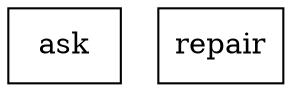
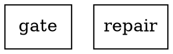

# `tractor reap`

Build the escript:

```sh
mix deps.get
mix escript.build
```

Run a DOT pipeline:

```sh
./bin/tractor reap examples/three_agents.dot
```

Run with the local LiveView observer:

```sh
./bin/tractor reap --serve examples/parallel_audit.dot
```

`--serve` starts an HTTP observer on `127.0.0.1`, prints the run URL before the
first node starts, runs the pipeline, then keeps the page available for
post-mortem inspection until Ctrl-C.

Use an explicit loopback port:

```sh
./bin/tractor reap --serve --port 4040 examples/parallel_audit.dot
```

Suppress browser auto-open:

```sh
./bin/tractor reap --serve --no-open examples/parallel_audit.dot
```

Write runs to a specific directory:

```sh
./bin/tractor reap examples/three_agents.dot --runs-dir /tmp/tractor-runs
```

Set a prompt timeout:

```sh
./bin/tractor reap examples/three_agents.dot --timeout 5m
```

Supported duration suffixes are `ms`, `s`, `m`, and `h`.

## Resilience Attributes

Runtime retry is configured on a node or as a graph default:

```dot
digraph {
  graph [retries=1, retry_base_ms=500, retry_backoff=exp, retry_jitter=true]
  ask [shape=box, llm_provider=codex, retries=2]
}
```



`retries=0` means one total attempt. `retries=2` means one initial attempt plus
two retry attempts. Retries are reserved for transient failures such as handler
crashes, ACP disconnects, provider timeouts, overloads, and node timeouts.
Retry attempts do not increment `max_iterations`; only the final successful or
failed attempt is recorded as semantic iteration history.

Retries always start a fresh ACP session. Prompts and side effects therefore
need to be idempotent across attempts, because cost and artifacts are counted
per attempt, not deduplicated across retries.

Node timeouts accept `ms`, `s`, `m`, and `h` suffixes:

```dot
ask [shape=box, llm_provider=claude, timeout="10m"]
```

Default handler timeouts are 10 minutes for `codergen`, 5 minutes for `judge`,
and 2 minutes for `parallel.fan_in`. Retried ACP calls start a fresh ACP session,
so handlers should be written with idempotent prompts and artifacts in mind.

Failure routing is opt-in on the declaring node:



If `ask` exhausts its retries, Tractor emits `:retry_routed` and starts
`repair` with a fresh per-node iteration counter. `context.__routed_from__`
is set on the recovery target's first iteration so conditions can branch on
provenance. Secondary recovery is owned by the original declaring node via
`fallback_retry_target`; Tractor does not consult the primary target's own
`retry_target` during the same recovery chain.

Goal gates mark must-succeed nodes:



If a `goal_gate=true` node exhausts retries plus any recovery targets, the run
finalizes as `{:goal_gate_failed, node_id}` and Tractor does not invoke `exit`.
Goal-gate satisfaction is checkpointed, so a resumed run does not re-gate a
node that already passed before the checkpoint.

Judge nodes may opt into `partial_success` continuation:

```dot
judge [
  shape=ellipse,
  type=judge,
  judge_mode=llm,
  allow_partial=true
]
```

With `allow_partial=true`, a judge can route through
`condition="partial_success"` without failing the run. Without it,
`partial_success` stays on the failure path. `parallel.fan_in` is the one
carveout: it continues on `partial_success` even without `allow_partial=true`.

Run-level budgets are graph attributes:

```dot
digraph {
  graph [max_total_iterations=20, max_wall_clock="30m"]
}
```

`max_total_iterations` counts semantic node iterations across the run.
`max_wall_clock` is checked between nodes and is persisted in the checkpoint;
`tractor reap --resume` computes elapsed time from the original wall-clock start.

Total token spend is also budgetable:

```dot
digraph {
  graph [max_total_cost_usd="0.25"]
}
```

Cost is accumulated from provider-reported token usage snapshots using the
static pricing table in `config/config.exs`. Tractor counts usage deltas, not
raw cumulative snapshots, and checks `max_total_cost_usd` between nodes. If
pricing is missing for a `{provider, model}` pair, Tractor emits `:cost_unknown`
once for that pair and continues without counting that spend.

## Condition DSL

Edge conditions support the original equality checks plus Tractor's extended
operators:

```dot
ask -> inspect [condition="!(outcome=fail) && (context.score >= 0.8 || context.error contains \"timeout\")"]
judge -> retry [condition="partial_success"]
```

Supported forms:

- `accept`, `reject`, `partial_success`
- `key=value`, `key!=value`
- `context.foo < 3`, `<=`, `>`, `>=`
- `context.error contains "timeout"`
- `&&`, `||`, prefix `!`, and parentheses

Numeric comparisons are restricted to `context.*` keys. Missing context values
evaluate as empty-string / false rather than raising.

## Status Feed And Plans

Enable the async status feed with:

```dot
digraph {
  graph [status_agent=claude]
}
```

Allowed values are `claude`, `codex`, `gemini`, and `off`. The status agent uses
a fresh ACP session for each completed top-level non-start/exit node, writes
artifacts under `_status_agent/<seq>/`, and streams `status_update` events to the
run feed. Main pipeline success does not depend on status-agent success.

ACP `session/update` plan events are persisted on the active node and rendered in
the node panel as the latest checklist. Each plan update replaces the previous
list for that node.

## Observer Requirements

The observer renders DOT through Graphviz at runtime. Install `dot` before using
`--serve`:

```sh
brew install graphviz
# or
sudo apt install graphviz
```

The page shows the DOT graph as SVG with node states, and a side panel for the
selected node's prompt, response, ACP message chunks, reasoning trace from ACP,
tool calls, wait-human resolution buttons, and stderr.

## Tool Nodes

Tool nodes run as the same OS user as the Tractor process. There is no
sandboxing, chroot, namespace isolation, or container boundary around them.
`command`, `cwd`, and `env` are parsed as literal values from DOT; only `stdin`
is template-rendered at runtime.

Example:

```dot
digraph {
  list_files [shape=parallelogram, command=["git","status","--short"]]
}
```

Tractor currently uses the `System.cmd/3` fallback path for tool execution, so
stdout and stderr are captured as one merged stream. Tool result payloads write
the merged output into `stdout` and leave `stderr` empty. This keeps retries,
artifacts, and truncation guards working, but it does not provide separate
stderr capture yet.

## Wait-Human Nodes

`wait.human` nodes suspend the runner until an operator picks one of the
outgoing edge labels or the optional `wait_timeout` elapses:

```dot
digraph {
  gate [shape=hexagon, wait_prompt="Approve?", wait_timeout="30s", default_edge="reject"]
  approved [shape=parallelogram, command=["sh","-c","printf approved"]]
  rejected [shape=parallelogram, command=["sh","-c","printf rejected"]]

  gate -> approved [label="approve"]
  gate -> rejected [label="reject"]
}
```

With `--serve`, the observer shows a button per outgoing label while the node is
waiting. Pending waits are checkpointed, so `tractor reap --resume ...` restores
the form and any remaining timeout budget.

## Conditional Nodes

`conditional` nodes do not call ACP or an external tool. They exist to make a
pure routing fork explicit in the graph:

```dot
digraph {
  route [shape=diamond]
  high_score [shape=parallelogram, command=["sh","-c","printf high"]]
  low_score [shape=parallelogram, command=["sh","-c","printf low"]]

  route -> high_score [condition="context.score >= 0.8"]
  route -> low_score [condition="!(context.score >= 0.8)"]
}
```

The shared edge selector still owns routing priority: conditional matches run
before preferred-label or unconditional fallback routing.

## Provider Overrides

Each provider supports command, args, and env overrides. Args must be JSON arrays.
Env must be a JSON object.

```sh
export TRACTOR_ACP_CODEX_COMMAND=codex-acp
export TRACTOR_ACP_CODEX_ARGS='[]'
export TRACTOR_ACP_CODEX_ENV_JSON='{"TOKEN":"secret"}'
```

Manifest files redact env values.

## Gemini

Default:

```sh
gemini --acp
```

If the Gemini CLI changes its ACP flag, override args:

```sh
export TRACTOR_ACP_GEMINI_ARGS='["--acp-mode"]'
```

or:

```sh
export TRACTOR_ACP_GEMINI_ARGS='["--experimental-acp"]'
```

## Claude

Default:

```sh
npx acp-claude-code
```

`Xuanwo/acp-claude-code` is archived. To use the Zed bridge package instead:

```sh
export TRACTOR_ACP_CLAUDE_COMMAND=npx
export TRACTOR_ACP_CLAUDE_ARGS='["@zed-industries/claude-code-acp"]'
```

## Codex

Default:

```sh
codex-acp
```

Override it the same way:

```sh
export TRACTOR_ACP_CODEX_COMMAND=codex-acp
export TRACTOR_ACP_CODEX_ARGS='[]'
```
